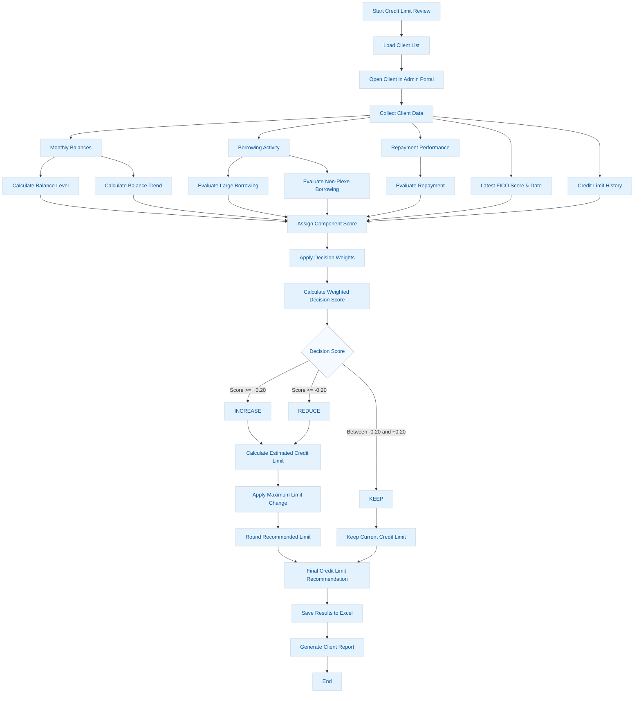

# credit-limit-review

Automates client credit limit reviews by collecting financial and credit
data using Python and Selenium, applying configurable credit-limit
decision rules, and generating Excel-based review outputs and
dashboards.

## Overview

The `credit-limit-review` project automates the process of reviewing
client credit limits.

The workflow reads a list of clients from an Excel file, logs into the
administrative platform, collects relevant client information, evaluates
credit-limit indicators, and produces a structured Excel report
containing the results.

The automation collects information including:

-   Monthly closing balances
-   Balance trends
-   Borrowing activity
-   Non-Plexe borrowing
-   Forecasted repayment percentage
-   Historical repayment percentage
-   Latest FICO score
-   Latest FICO report date
-   Credit / limit adjustment history
-   Current credit limit
-   Credit-limit review indicators

The collected information is then used to calculate a weighted decision
score and provide a recommended credit-limit action.

## Workflow


## Credit Limit Decision Logic

The review uses configurable decision components:

  -----------------------------------------------------------------------
  Component                           Purpose
  ----------------------------------- -----------------------------------
  Balance Level                       Evaluates recent balances relative
                                      to the current credit limit

  Balance Trend                       Determines whether recent balances
                                      are increasing, decreasing, or
                                      stable

  Large Borrowing                     Identifies significant recent
                                      borrowing activity

  Non-Plexe Borrowing                 Identifies borrowing outside Plexe

  Repayment                           Evaluates forecasted and historical
                                      repayment performance
  -----------------------------------------------------------------------

Each component contributes to the final weighted decision score.

The weights can be configured in the notebook:

``` python
DECISION_WEIGHTS = {
    "balance_level": 1.0,
    "balance_trend": 1.0,
    "large_borrowing": 1.0,
    "non_plexe_borrowing": 1.0,
    "repayment": 1.0
}
```

Default decision thresholds:

``` text
Score >= +0.20  -> Increase
Score <= -0.20  -> Reduce
Otherwise        -> Keep
```

The recommended limit is rounded to the configured credit-limit
increment.

## FICO Processing

The automation identifies all available FICO report dates for a client
and determines the latest date chronologically.

``` text
Find all FICO dates
        |
        v
Parse dates
        |
        v
Select maximum/latest date
        |
        v
Identify corresponding report tab
        |
        v
Click latest report
        |
        v
Read FICO score
        |
        v
Save Latest FICO + Latest FICO Date
```

This allows the automation to handle clients with different numbers of
FICO reports.

## Output

The automation generates an Excel workbook containing detailed review
information, including:

-   Monthly Balance
-   Borrowing
-   Repayment
-   FICO
-   Credit Limit Review
-   Limit Adjustment History

The final review combines the collected information into a consolidated
credit-limit assessment.

## Requirements

The project requires Python 3 and the following main packages:

``` text
selenium
openpyxl
```

Install the dependencies using:

``` bash
pip install selenium openpyxl
```

Google Chrome must also be installed. Selenium Manager can automatically
identify and obtain a compatible ChromeDriver.

## Input File

The automation expects an Excel file containing client information.

At minimum, the input file should contain:

``` text
Business Name
```

Update the input file location before running the notebook:

``` python
CLIENT_FILE = r"path\to\client_file.xlsx"
```

## Output Location

Configure the folder where generated reports should be stored:

``` python
OUTPUT_FOLDER = r"path\to\output\folder"
```

The primary Excel output is generated as:

``` text
client_balance_borrowing_review_dashboard.xlsx
```

## Configuration

Several parameters can be adjusted at the beginning of the notebook:

``` python
BATCH_SIZE = 50
MAX_WORKERS = 5
BROWSER_START_DELAY = 3
```

Credit-limit decision parameters can also be configured:

``` python
REPAYMENT_STRONG = 30.0
REPAYMENT_GOOD = 25.0
REPAYMENT_LOW = 15.0

MAX_WEIGHTED_LIMIT_CHANGE = 0.25

INCREASE_SCORE_THRESHOLD = 0.20
REDUCE_SCORE_THRESHOLD = -0.20

LIMIT_ROUNDING = 5000
```

## Running the Project

1.  Clone the repository.

``` bash
git clone <repository-url>
```

2.  Install the required Python packages.

``` bash
pip install selenium openpyxl
```

3.  Configure the input and output paths.
4.  Configure login credentials securely.
5.  Open `credit_limit_review.ipynb`.
6.  Run the notebook.
7.  Review the generated Excel report and credit-limit recommendations.

## Security

Do not store usernames, passwords, API keys, or other credentials
directly in the repository.

Use environment variables or another secure secret-management method:

``` python
import os

USERNAME = os.getenv("PLEXE_USERNAME")
PASSWORD = os.getenv("PLEXE_PASSWORD")
```

Recommended `.gitignore` entries:

``` gitignore
.env
*.xlsx
.ipynb_checkpoints/
__pycache__/
```

## Error Handling

The automation processes clients independently so that an issue with one
client does not necessarily prevent the remaining clients from being
reviewed.

Console logging is used throughout the workflow to show:

-   Current client
-   Processing step
-   Captured balances
-   Borrowing records
-   Repayment values
-   FICO dates
-   Latest FICO score
-   Credit-limit information
-   Errors and failed extraction steps

## Project Structure

``` text
credit-limit-review/
|
|-- README.md
|-- credit_limit_review.ipynb
|-- requirements.txt
|-- .gitignore
|
`-- output/
```

Generated Excel files should normally remain outside source control.

## Disclaimer

The generated credit-limit recommendation is based on the configured
rules and the data successfully collected by the automation.

The output should be treated as decision-support information and
reviewed according to the organization's credit policies and approval
procedures before making final credit-limit changes.
